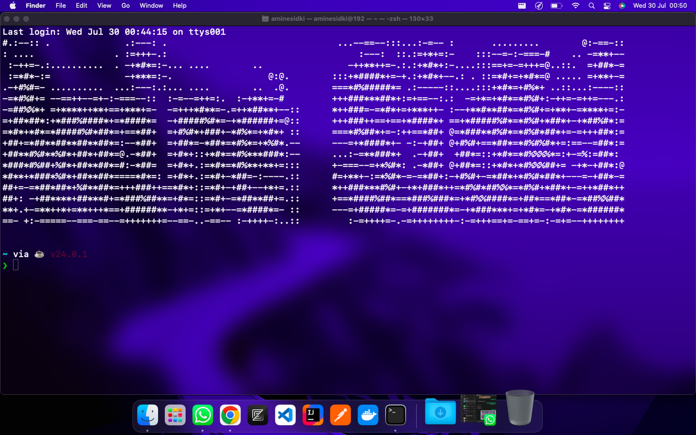

# Aasciilicious
It's basically custom neofetch

> To use it for an image use ```java -jar Aasciilitious.jar <YourImage>``` in the terminal , better yet , you could use it in the .zshrc / .bashrc file depending on the shell you are using
## Dependencies :
> Java.
 
## General word of advice
> Use it with a low-res (or high-res if u have a MASSIVE display) no background Png file for best results.

## Results :

